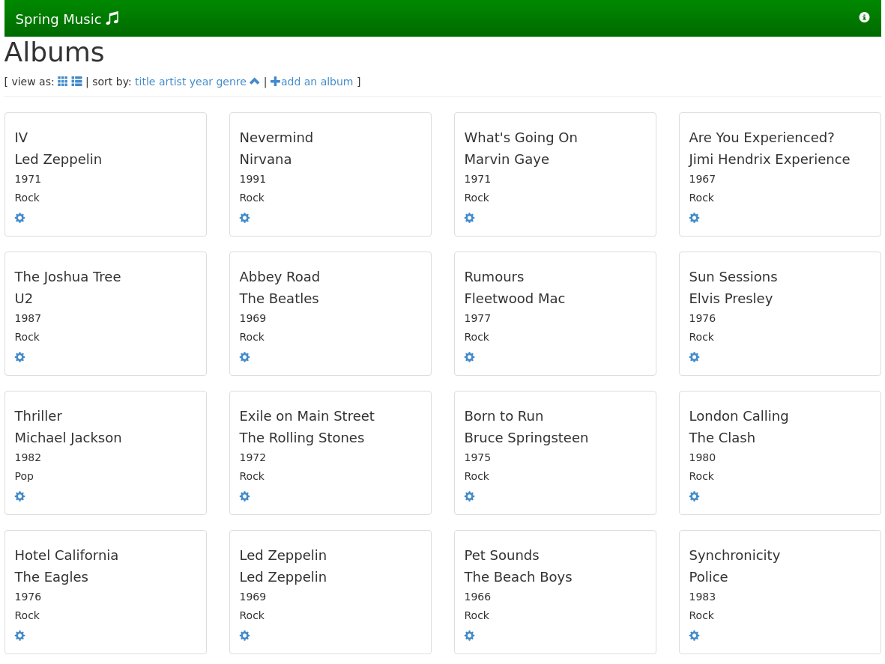
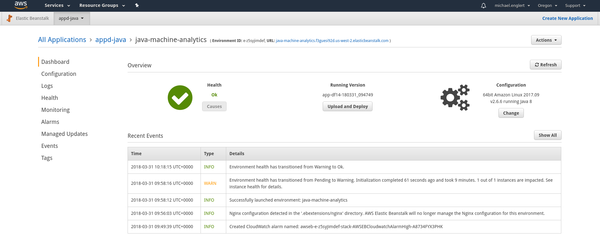
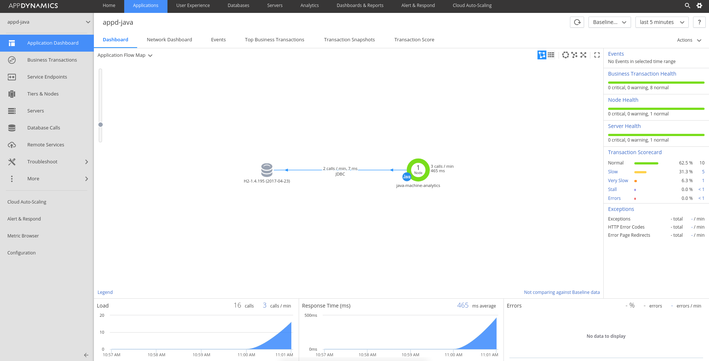
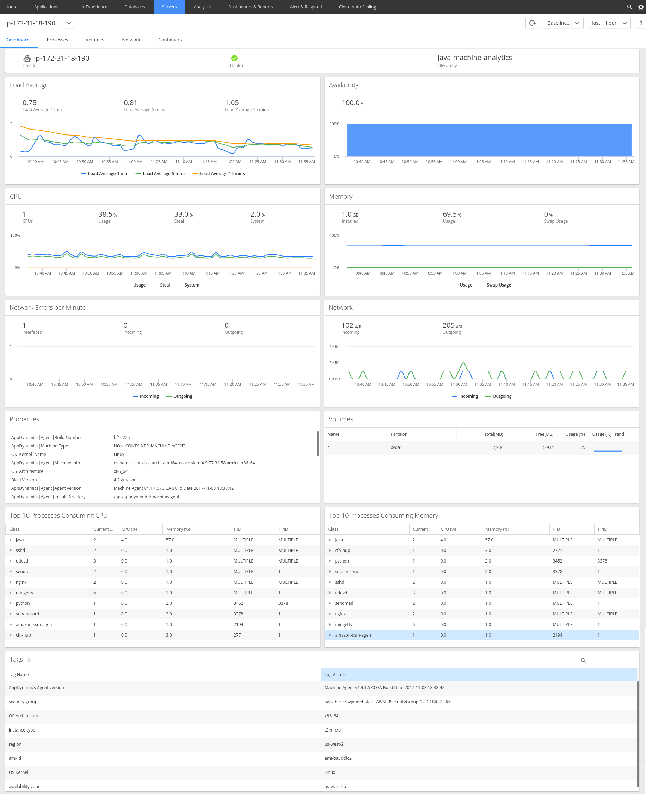
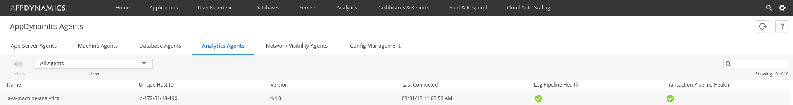

# AppDynamics Agent Deployment on AWS Elastic Beanstalk
## Introduction
This repository contains the logic to deploy AppDynamics Agents within an AWS Elastic Beanstalk environment. The standard Extension process of Elastic Beanstalk is used. The extension will be added by creating a folder called `.ebextensions` within your Application Folder. General Details can be found in the [.ebextensions Documentation].

The steps performed by the Extensions could vary by technology but here is a general description:
* Download of the Agent Bits
* Execution of the Deployment Script
  * Setting of the the Environment variables
  * Extracting the Agent
  * Configuration of the Application
  * Startup of the Agent if needed

## Supported Technologies/Agents
| Platform | Application Agent | Machine Agent | Analytics Agent |
|:--------:|:-----------------:|:-------------:|:---------------:|
| Java     | Yes               | Yes           | Yes             |
## Repository Structure
| Folder                                           | Description                                                     |
|--------------------------------------------------|-----------------------------------------------------------------|
| `_common`                                        | Files that span across each platform                            |
| `_common/.ebextensions/nginx`                    | Nginx configuration for the sample application                  |
| `<platform>-(machine)-(analytics)`               | Platform and Agent specific scripts                             |
| `<platform>-(machine)-(analytics)/.ebextensions` | Platform specific AWS Elastic Beanstalk Extension Configuration |
| `<platform>-(machine)-(analytics)/testing`       | Testing Script for Linux                                        |
## Supported Environment Variables
| Variable                              | Description                                                         | Required | Default   |
|---------------------------------------|---------------------------------------------------------------------|----------|-----------|
| APPDYNAMICS_CONTROLLER_HOST_NAME      | [Environment Variables for Agent]                                   | Yes      | N/A       |
| APPDYNAMICS_CONTROLLER_PORT           | [Environment Variables for Agent]                                   | Yes      | N/A       |
| APPDYNAMICS_CONTROLLER_SSL_ENABLED    | [Environment Variables for Agent]                                   | No       | false     |
| APPDYNAMICS_AGENT_ACCOUNT_NAME        | [Environment Variables for Agent]                                   | No       | customer1 |
| APPDYNAMICS_AGENT_ACCOUNT_ACCESS_KEY  | [Environment Variables for Agent]                                   | Yes      | N/A       |
| APPDYNAMICS_AGENT_APPLICATION_NAME    | [Environment Variables for Agent]                                   | Yes      | N/A       |
| APPDYNAMICS_AGENT_TIER_NAME           | [Environment Variables for Agent]                                   | No       | Env Name  |
| APPDYNAMICS_SIM_ENABLED               | [Environment Variables for Agent]                                   | No       | false     |
| APPDYNAMICS_AGENT_GLOBAL_ACCOUNT_NAME | Setting required for Business iQ. See [Analytics Agent] for details | No       | N/A       |
| APPDYNAMICS_ANALYTICS_EVENT_ENDPOINT  | Setting required for Business iQ. See [Analytics Agent] for details | No       | N/A       |
| APPDYNAMICS_DEBUG                     | Will set the Agents Logging Level to Debug if true                  | No       | N/A       |
## Install Pre-requisites
### MacOS
Check [MacOS EB CLI Install] for details. Install using homebrew:
* `brew update`
* `brew install awsebcli`

## Deployment
* Clone this repository
  * `git clone https://github.com/appdynamics/aws-elasticbeanstalk`
* Navigate to your Application Folder or Clone your Application repository
  * `git clone https://github.com/cloudfoundry-samples/spring-music`
  * `cd spring-music`
* Copy or create the `.ebextensions` Folder within your Apps root folder
  * `mkdir .ebextensions`
* Depending on your application you might need to change the Nginx configuration
  * `cp -r ../aws-elasticbeanstalk/_common/.ebextensions/nginx ./.ebextensions/`
* Copy or create the `.ebextensions/appd.config` File into the previously created Folder
  * `cp ../aws-elasticbeanstalk/java/.ebextensions/appd.config ./.ebextensions/`
* Configure the `appd.config` File
  * Select the appropriate Agent Versions e.g.:  
    ```
    source: https://packages.appdynamics.com/java/4.4.0.3/AppServerAgent-4.4.0.3.zip
    ```
  * Configure the Environment Variables. These are the minimum required ones:  
    ```
    APPDYNAMICS_CONTROLLER_HOST_NAME:
    APPDYNAMICS_CONTROLLER_PORT:
    APPDYNAMICS_AGENT_ACCOUNT_ACCESS_KEY:
    APPDYNAMICS_AGENT_APPLICATION_NAME:
    ```
* Make sure you got your `Buildfile` (how your application bits are built) and `Procfile` (how your application is started)
  * Buildfile e.g. `build: ./gradlew clean assemble`
  * Procfile e.g. `web: java -Dserver.port=8080 -Dspring.profiles.active=in-memory -jar build/libs/staging-1.0.jar`
* Commit your changes
  * `git add ./`
  * `git commit -m "my app with appdynamics"`
* Deploy your Application
  * `eb init <MY-NEW-EB-APP> -p java`
  * `eb create <MY-NEW-EB-APP-ENV>`

## Sample Deployment
### Linux using Testing Script
* Make sure you have `git` and `eb` (Elastic Beanstalk CLI) installed
* Clone this Repository `git clone https://github.com/appdynamics/aws-elasticbeanstalk.git`
* Navigate to the Agent Combination you want to test `cd ./aws-elasticbeanstalk/<platform>-(machine)-(analytics)/testing`
* Execute the `test.sh` script with the corresponding options
  * e.g. `./test.sh -a <APP_NAME> -b <BASE_DIR> -e <ENV_NAME> -r <AWS_REGION> -i <AWS_INSTANCE_TYPE> -c <APPDYNAMICS_CONTROLLER_HOST_NAME> -p <APPDYNAMICS_CONTROLLER_PROTOCOL> -K <APPDYNAMICS_AGENT_ACCOUNT_ACCESS_KEY>`
  * The script will prompt if you forget to specify all required options
  * You can display the Usage Info by `./test.sh -h`

### Screenshots
* Sample Application UI

* Elastic Beanstalk UI

* AppDynamics Flowmap

* AppDynamics Server Visibility

* AppDynamics Analytics Agent

## Important Notes
* There is a delay of the Machine Agent Startup, so give it some time.

## Troubleshooting
* Get all Elastic Beanstalk Log Files as `.zip`
  * `eb logs -z`
* Where to look
  * Staging/Build/Deployment Errors `eb-activity.log`
  * Application Logs `web-1.log` and `web-1.error.log` (Example for a Java web App)

## TODO
* Source Rules for EB Log files
* Other Technologies
* Automated Jenkins testing

[MacOS EB CLI Install]: https://docs.aws.amazon.com/elasticbeanstalk/latest/dg/eb-cli3-install-osx.html
[Environment Variables for Agent]: https://docs.appdynamics.com/display/latest/Use+Environment+Variables+for+Java+Agent+Settings
[Analytics Agent]: https://docs.appdynamics.com/display/latest/Installing+Agent-Side+Components#InstallingAgent-SideComponents-InstallAnalyticsAgentonLinux
[.ebextensions Documentation]: https://docs.aws.amazon.com/elasticbeanstalk/latest/dg/ebextensions.html
